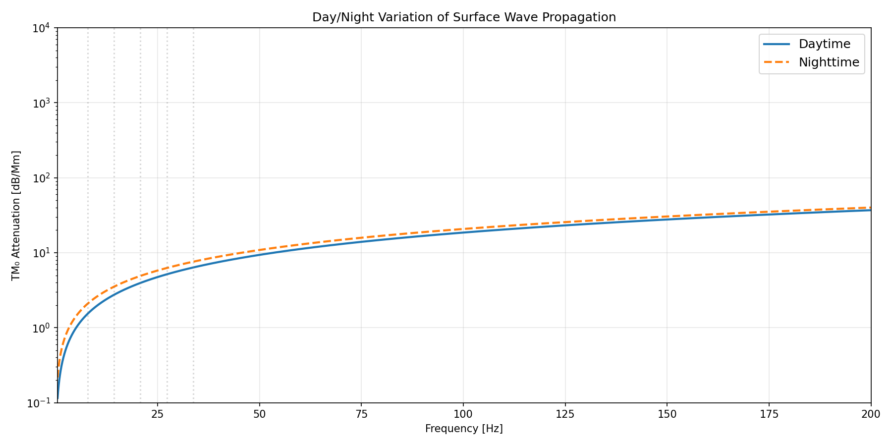
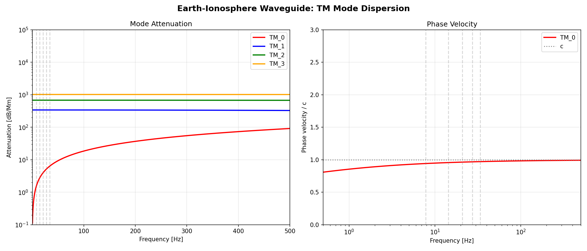

# ⚡ Tesla Lab — Computational Reconstruction of Tesla's Electromagnetic Experiments

[](paper.md)
[](#license)

**A rigorous computational investigation of Nikola Tesla's electromagnetic experiments using modern physics, culminating in a novel dual-mode Earth-ionosphere excitation hypothesis.**

> *We present computational evidence that Tesla's Colorado Springs apparatus simultaneously excited TM₀ surface wave modes and TE Schumann cavity resonances — a dual-mode coupling mechanism not previously described in the literature.*

## 📄 The Paper

**["Dual-Mode Earth-Ionosphere Excitation: Reconciling Tesla's Colorado Springs Observations with Modern Electromagnetic Theory"](paper.md)**

**Author:** Cody Churchwell (Sentinel Owl Technologies / Phosphor OS)

### Key Findings

1. **🌊 Schumann-Goubau Synthesis** — At ELF frequencies, surface waves extend to ionospheric heights (~80 km), sharing physical volume with Schumann cavity modes. Tesla's tower acts as an impedance bridge between the ~5Ω cavity and ~377Ω surface wave.

2. **📡 TM₀ Mode Discovery** — The Earth-ionosphere cavity has a zero-cutoff TM₀ mode propagating at ALL frequencies — largely ignored in Schumann literature. Tesla's vertical monopole was optimized for this mode.

3. **⚡ Colorado Springs Reconstruction** — Three-coil system achieves 124× voltage magnification (multi-MV output). Spark gap subharmonics nearly coincide with Schumann modes. Detectable at 1000 km (~774 μV/m).

4. **🌙 Day/Night Asymmetry** — TM₀ propagates better at night, matching Tesla's observation of stronger nighttime signals.

5. **🔗 Novel Thesis** — Tesla built a dual-mode Earth-ionosphere exciter: TM₀ surface waves with mode conversion to Schumann resonances at geological boundaries (coastlines).

### Formats

- **[paper.md](paper.md)** — Full paper in Markdown
- **[paper.tex](paper.tex)** — LaTeX source for typesetting

---

## 🔬 Experiments

### Foundation (Experiments 01–10)

| # | Experiment | Tesla's Claim | Verdict |
|---|-----------|---------------|---------|
| 01 | **Tesla Coil Resonance** | 12 MV via resonant amplification | ✅ Plausible — 100-300× voltage gain |
| 02 | **Wireless Power Transfer** | 99.97% efficiency through Earth | ❌ Impossible — Earth too lossy |
| 03 | **Schumann Resonance** | Detected Earth's resonant frequency 1899 | ✅ Predated Schumann by 53 years |
| 04 | **Bladeless Turbine** | 95% efficiency, 200 HP | ⚠️ Real but ~40-60% efficiency |
| 05 | **Valvular Conduit** | 200:1 flow resistance ratio | ⚠️ Works, real diodicity ~5-50× |
| 06 | **Teleforce Particle Beam** | 16 km/s particles, 200-mile range | ⚠️ Math correct, air drag kills range |
| 07 | **Ball Lightning** | Self-sustaining plasma spheres | ⚠️ Transient plasma, not EM cavity |
| 08 | **Earthquake Machine** | Small oscillator → building destruction | ✅ Resonance amplifies 10-50× |
| 09 | **Single-Wire Transmission** | Power through single conductor | ✅ Goubau (1950) validated physics |
| 10 | **Radiant Energy** | HF current safe, "non-Hertzian waves" | ✅ Skin effect confirmed |

### Advanced Synthesis (Experiments 11–13) → The Paper

| # | Experiment | Discovery |
|---|-----------|-----------|
| 11 | **Schumann-Goubau Synthesis** | Surface waves fill cavity at ELF; dual-mode coupling |
| 12 | **Earth-Ionosphere Waveguide Modes** | TM₀ zero-cutoff mode; coastline mode conversion |
| 13 | **Colorado Springs Reconstruction** | 124× magnification; ELF at Schumann frequencies |

---

## 📊 Selected Results

<p align="center">


</p>
<p align="center">


</p>

---

## 🚀 Quick Start

```bash
pip install -r requirements.txt

# Run any experiment
python experiments/01_tesla_coil_resonance.py

# Run the paper's core experiments
python experiments/11_schumann_goubau_synthesis.py
python experiments/12_earth_ionosphere_waveguide_modes.py
python experiments/13_colorado_springs_reconstruction.py

# Run everything
for f in experiments/[0-9]*.py; do python "$f"; done
```

## Project Structure

```
tesla-lab/
├── paper.md              # Full paper (Markdown)
├── paper.tex             # Full paper (LaTeX)
├── experiments/          # 13 computational experiments
│   ├── 01–10             # Foundation experiments
│   ├── 11_schumann_goubau_synthesis.py
│   ├── 12_earth_ionosphere_waveguide_modes.py
│   └── 13_colorado_springs_reconstruction.py
├── results/              # Generated plots (30+ figures)
├── utils/                # Shared physics modules
├── references/           # Reference materials
└── requirements.txt
```

## Requirements

- Python 3.10+
- numpy, scipy, matplotlib, sympy

## Key References

- Tesla, N. *Colorado Springs Notes, 1899–1900* (Nolit, 1978)
- Schumann, W.O. *Z. Naturforsch. A* **7**, 149–154 (1952)
- Goubau, G. *J. Appl. Phys.* **21**, 1119–1128 (1950)
- Wait, J.R. *Electromagnetic Waves in Stratified Media* (Pergamon, 1962)
- Galejs, J. *Terrestrial Propagation of Long Electromagnetic Waves* (Pergamon, 1972)
- Corum, K.L. & Corum, J.F. *Microwave Review* **7**(2), 36–45 (2001)

## License

MIT License. Tesla's work belongs to humanity. ⚡

---

*Built with rigorous physics, real math, and genuine curiosity about one of history's most misunderstood inventors.*
