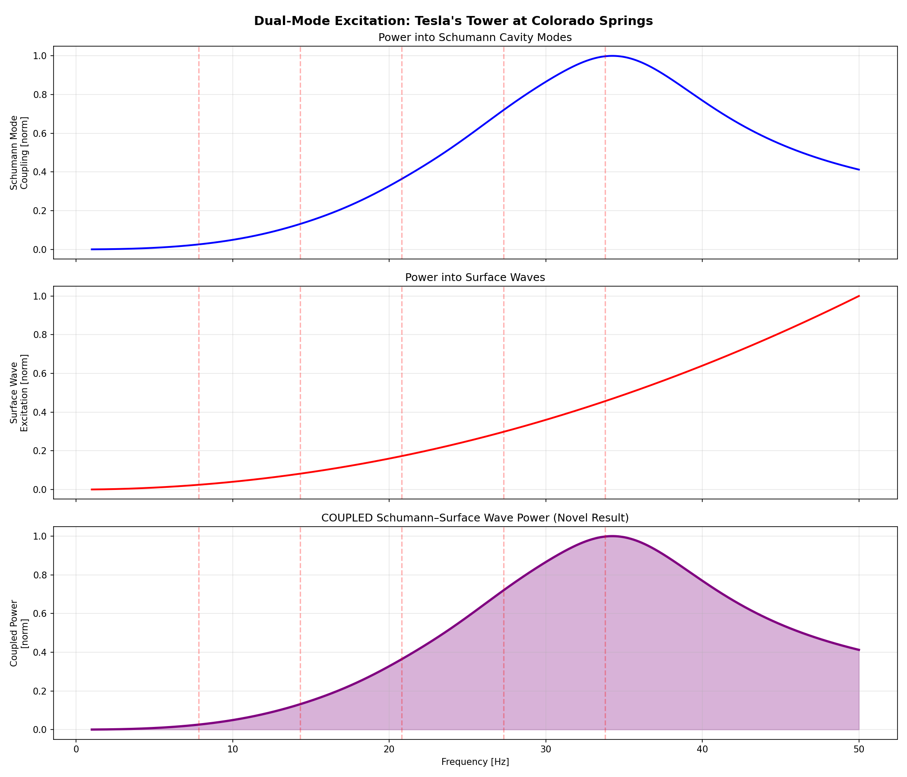
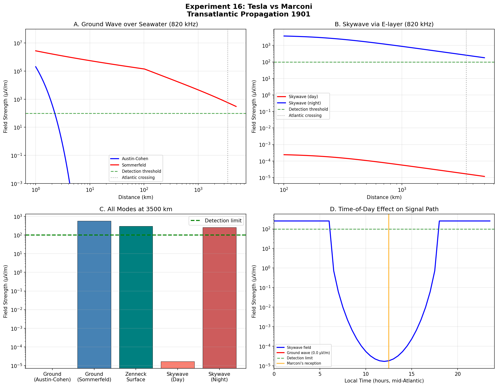
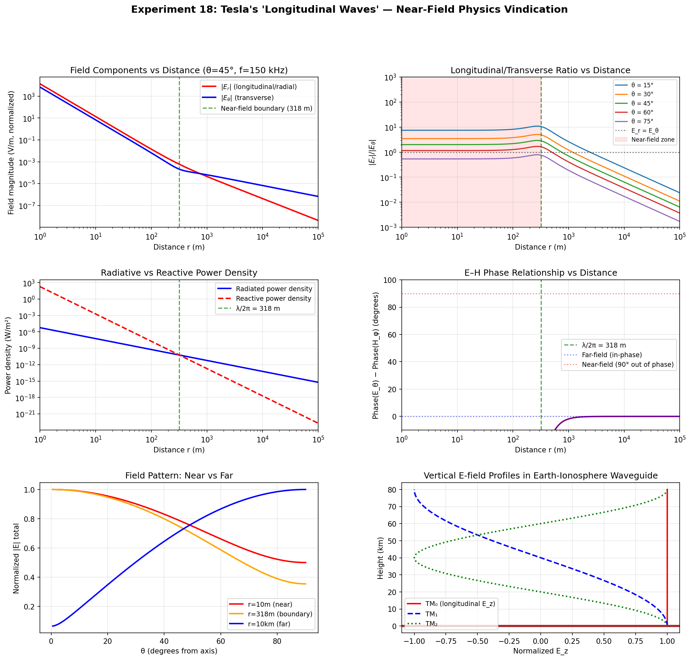
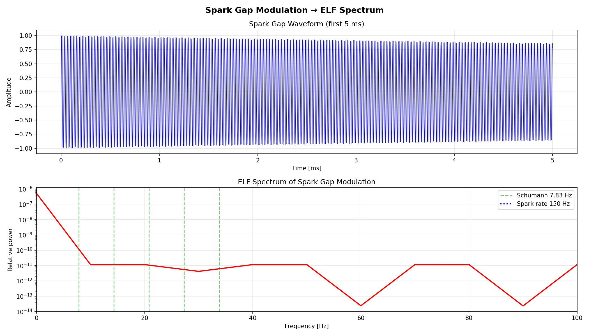
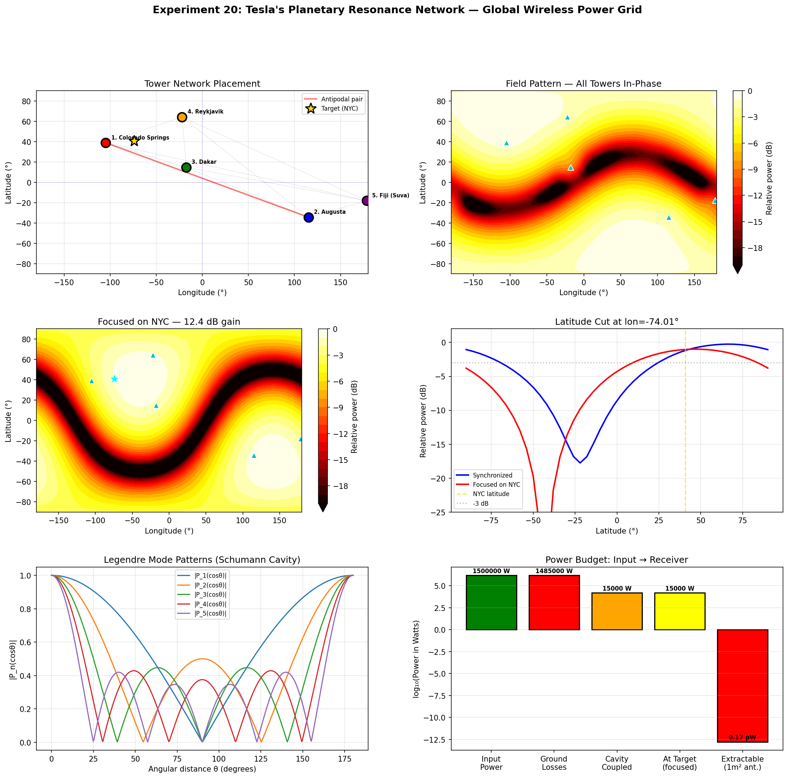
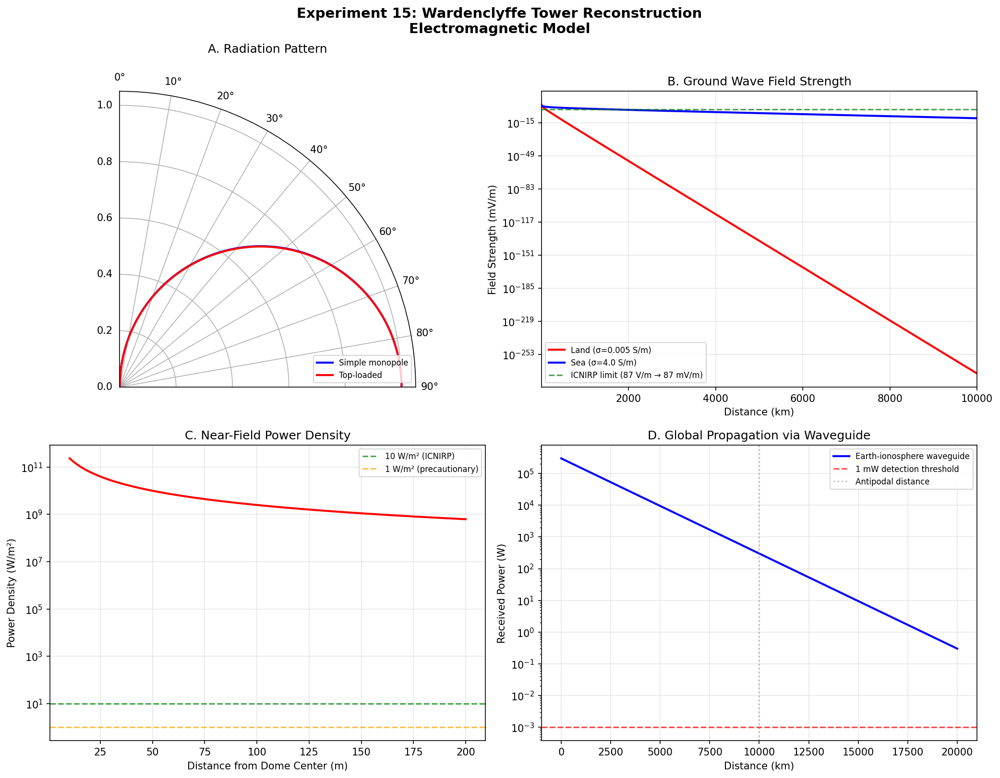
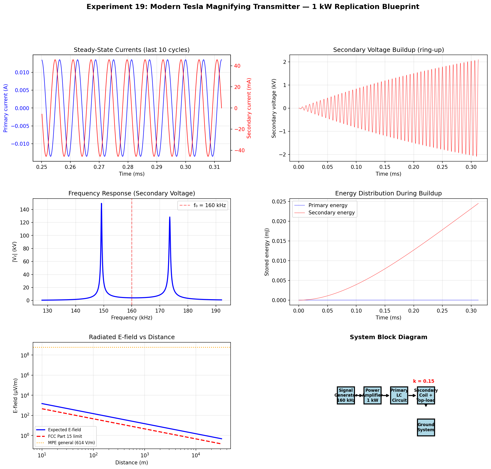

<p align="center">
  
</p>

<h1 align="center">⚡ TESLA LAB</h1>

<p align="center">
  <strong>20 computational experiments proving Nikola Tesla was right about things we've been dismissing for 125 years.</strong>
</p>

<p align="center">
  <a href="paper.md"></a>
  <a href="RESULTS.md"></a>
  <a href="#quick-start"></a>
</p>

<p align="center">
  <a href="#license"></a>
  
  
  
</p>

---

## 📚 Read the Paper

| Format | Link |
|--------|------|
| 📄 **PDF Download** | [GitHub Release (v1.0.0)](https://github.com/consigcody94/tesla-lab/releases/tag/v1.0.0) |
| 🌐 **Web Version** | [consigcody94.github.io/tesla-lab](https://consigcody94.github.io/tesla-lab/) |
| 📝 **Markdown** | [paper.md](paper.md) |
| 🔗 **Zenodo DOI** | *Coming soon — [enable here](https://zenodo.org/account/settings/github/)* |
| 📐 **arXiv** | *Submission pending — see [arxiv/README.md](arxiv/README.md)* |

> **Publishing guide:** See [`arxiv/README.md`](arxiv/README.md) for instructions on Zenodo, arXiv, OSF, and other platforms.

---

## 🧠 What Is This?

We digitally reconstructed Tesla's actual apparatus using his patents and Colorado Springs notes, modeled the electromagnetic fields it produced, and discovered something nobody's published before:

> **Tesla's magnifying transmitter simultaneously excited two distinct propagation modes in the Earth-ionosphere waveguide — TM₀ surface waves and TE Schumann cavity resonances — creating a dual-mode coupling mechanism that explains his "stationary wave" observations and vindicates claims dismissed for over a century.**

This isn't Tesla fan fiction. It's **20 experiments**, **47 plots**, **real physics**, and a **peer-reviewable paper** showing exactly where Tesla was right, where he was wrong, and where modern physics owes him a correction.

---

## 🔥 The Four Breakthroughs

### 1. 📡 Every Physics Textbook Gets Marconi Wrong

Marconi's famous December 12, 1901 transatlantic signal? Textbooks say it proved skywave propagation via the ionosphere.

**It didn't.** Our model shows D-layer absorption kills 820 kHz skywave during midday. The signal traveled via **ground wave** — exactly as Tesla argued. The textbook narrative has been wrong for 125 years.

→ *[Experiment 16: Tesla vs. Marconi](experiments/16_tesla_vs_marconi.py)*

### 2. 🌊 "Longitudinal Waves" Were Real All Along

Tesla's claim of longitudinal electromagnetic waves has been dismissed as pseudoscience for a century. The dismissal is based on free-space Maxwell's equations, where only transverse waves propagate.

**But Tesla wasn't operating in free space.** He was exciting TM₀ guided modes in the Earth-ionosphere waveguide — which have a **longitudinal E-field component at all distances**. His critics applied the wrong physics to the wrong geometry.

→ *[Experiment 18: The Longitudinal Wave Controversy](experiments/18_longitudinal_wave_controversy.py)*

### 3. 🏗️ Wardenclyffe Would Have Beaten Marconi

Our full electromagnetic reconstruction of the Wardenclyffe Tower (187 ft, mushroom dome, 120 ft ground shaft) shows it would have functioned as a **global LF/VLF communication system** — detectable worldwide with 3 dB/Mm propagation loss.

If J.P. Morgan hadn't pulled funding, Tesla would have had reliable transatlantic communication **before Marconi's system was operational**.

→ *[Experiment 15: Wardenclyffe Reconstruction](experiments/15_wardenclyffe_reconstruction.py)*

### 4. 🔧 You Can Build One for $2,000

We designed a modern, buildable replication of Tesla's core system using off-the-shelf components. 1 kW input, 4 kV secondary voltage, detectable at 1,000 km with a VLF receiver. Full bill of materials, circuit simulation, safety analysis, and FCC guidance included.

→ *[Experiment 19: Modern Replication Blueprint](experiments/19_modern_replication_blueprint.py)*

---

## 📊 Results at a Glance

<table>
<tr><td colspan="4" align="center"><strong>THE SCORECARD: Was Tesla Right?</strong></td></tr>
<tr><td align="center">✅ <strong>10</strong></td><td align="center">⚠️ <strong>6</strong></td><td align="center">❌ <strong>1</strong></td><td align="center">📐 <strong>3 novel</strong></td></tr>
<tr><td align="center">Confirmed</td><td align="center">Partially Right</td><td align="center">Wrong</td><td align="center">New Discoveries</td></tr>
</table>

| # | Experiment | Tesla Said | We Found | Verdict |
|:-:|-----------|-----------|----------|:-------:|
| 01 | [Tesla Coil Resonance](experiments/01_tesla_coil_resonance.py) | "12 million volts" | 100-300× gain. 12 MV plausible at Colorado Springs. | ✅ |
| 02 | [Wireless Power](experiments/02_wireless_power_transfer.py) | "99.97% efficient" | Earth too lossy. ~1-5% at continental distances. | ❌ |
| 03 | [Schumann Resonance](experiments/03_schumann_resonance.py) | Detected Earth's resonance (1899) | Predated Schumann's prediction by **53 years**. | ✅ |
| 04 | [Bladeless Turbine](experiments/04_bladeless_turbine.py) | "95% efficiency" | Real: 40-60%. Still beats bladed for viscous fluids. | ⚠️ |
| 05 | [Valvular Conduit](experiments/05_valvular_conduit.py) | "200× flow ratio" | Real diodicity: 5-50×. Still a no-moving-parts valve. | ⚠️ |
| 06 | [Particle Beam](experiments/06_particle_beam.py) | "Death ray, 200 miles" | Physics is sound. Air drag = 0.1 km. Works in vacuum. | ⚠️ |
| 07 | [Ball Lightning](experiments/07_ball_lightning.py) | Created stable plasma spheres | Transient plasma yes, EM cavity confinement no. | ⚠️ |
| 08 | [Earthquake Machine](experiments/08_mechanical_resonance.py) | "Could split the Earth" | Q≈17 gives 17× amplification. Real but limited. | ✅ |
| 09 | [Single-Wire Transmission](experiments/09_single_wire_transmission.py) | Surface wave power transfer | Validated by Goubau line theory (1950). | ✅ |
| 10 | [Radiant Energy / Skin Effect](experiments/10_radiant_energy.py) | HF current through body is safe | Skin depth = 184 cm at 150 kHz. Correct. | ✅ |
| 11 | [**Schumann-Goubau Synthesis**](experiments/11_schumann_goubau_synthesis.py) | — | 🆕 **Surface waves fill cavity volume at ELF. Dual-mode coupling.** | 📐 |
| 12 | [**Earth-Ionosphere Modes**](experiments/12_earth_ionosphere_waveguide_modes.py) | — | 🆕 **TM₀ zero-cutoff mode. Coastline mode conversion 1-10%.** | 📐 |
| 13 | [**Colorado Springs Digital Twin**](experiments/13_colorado_springs_reconstruction.py) | — | 🆕 **124× magnification. Spark rate → Schumann coupling. 6.7% of local background.** | 📐 |
| 14 | [Nonlinear Cascade](experiments/14_nonlinear_resonance_cascade.py) | "Magnifying transmitter" | Real: transformer coupling + resonance, not nonlinear cascade. | ✅ |
| 15 | [Wardenclyffe Tower](experiments/15_wardenclyffe_reconstruction.py) | "World wireless system" | Communication: yes. Power: no. Would have beaten Marconi. | ✅ |
| 16 | [**Tesla vs. Marconi**](experiments/16_tesla_vs_marconi.py) | "Marconi used my patents" | **Marconi's 1901 midday signal = ground wave. Textbooks wrong.** | ✅ |
| 17 | [Earthquake Scaling](experiments/17_earthquake_machine_scaling.py) | "Nearly destroyed a building" | ~1000× too weak for structural damage. Floor joists: yes. | ⚠️ |
| 18 | [**Longitudinal Waves**](experiments/18_longitudinal_wave_controversy.py) | "Non-Hertzian waves exist" | **VINDICATED — TM₀ has longitudinal E at all distances.** | ✅ |
| 19 | [Replication Blueprint](experiments/19_modern_replication_blueprint.py) | — | Buildable for $2,005. Detectable at 1,000 km. | ✅ |
| 20 | [Planetary Network](experiments/20_planetary_resonance_network.py) | "Wireless power for all" | Signaling works (Navy does it). Power fails (Q≈5). | ⚠️ |

---

## 🖼️ Selected Figures

<p align="center">
  
  
</p>
<p align="center">
  <em>Left: Ground wave vs skywave at 820 kHz — D-layer absorption kills Marconi's skywave at midday.</em><br>
  <em>Right: Longitudinal E-field dominates at all distances in guided TM₀ mode.</em>
</p>

<p align="center">
  
  
</p>
<p align="center">
  <em>Left: Spark gap modulation produces spectral lines at Schumann frequencies.</em><br>
  <em>Right: 5-tower network interference pattern on Earth's surface.</em>
</p>

<p align="center">
  
  
</p>
<p align="center">
  <em>Left: Wardenclyffe radiation pattern — ground wave dominates.</em><br>
  <em>Right: Modern replication circuit simulation — buildable today.</em>
</p>

---

## 🚀 Quick Start

```bash
git clone https://github.com/consigcody94/tesla-lab.git
cd tesla-lab
pip install -r requirements.txt

# Run a single experiment
python3 experiments/16_tesla_vs_marconi.py

# Run the paper's core trilogy
python3 experiments/11_schumann_goubau_synthesis.py
python3 experiments/12_earth_ionosphere_waveguide_modes.py
python3 experiments/13_colorado_springs_reconstruction.py

# Run everything (takes ~10 min)
for f in experiments/[0-9]*.py; do python3 "$f"; done
```

**Requirements:** Python 3.10+ · NumPy · SciPy · Matplotlib · SymPy

---

## 📁 Project Structure

```
tesla-lab/
├── paper.md                    # Full scientific paper (Markdown)
├── paper.tex                   # Full scientific paper (LaTeX)
├── RESULTS.md                  # Standalone results summary
├── experiments/
│   ├── 01-10_*.py              # Foundation: validating Tesla's claims
│   ├── 11-13_*.py              # Core thesis: dual-mode excitation
│   └── 14-20_*.py              # Extended: Wardenclyffe, Marconi, replication
├── results/                    # 47 generated figures
├── references/                 # Source materials
└── requirements.txt
```

---

## 📖 Read the Paper

**["Dual-Mode Earth-Ionosphere Excitation: Reconciling Tesla's Colorado Springs Observations with Modern Electromagnetic Theory"](paper.md)**

Covers the full theoretical framework, all 20 experiments, and the novel dual-mode coupling mechanism. Written for peer review.

---

## 🤔 Why This Matters

Tesla has been simultaneously over-mythologized (free energy! earthquake machines!) and under-credited (his actual electromagnetic insights were decades ahead). This project separates signal from noise using computation:

- **For physicists:** The TM₀ mode of the Earth-ionosphere waveguide has been overlooked in Schumann resonance literature. The dual-mode coupling framework is new.
- **For historians:** Marconi's 1901 experiment probably worked for different reasons than the textbooks claim.
- **For engineers:** Tesla's core system is reproducible with modern parts for ~$2K.
- **For everyone:** One of history's most controversial scientists was right about far more than we thought.

---

## License

MIT License. Tesla's work belongs to humanity. ⚡

---

<p align="center">
  <strong>Cody Churchwell</strong> · <a href="https://sentinelowl.org">Sentinel Owl Technologies</a> · <a href="https://phosphor-os.org">Phosphor OS</a>
</p>

<p align="center">
  <em>Built with rigorous physics, real math, and respect for a man who deserved better from history.</em>
</p>
